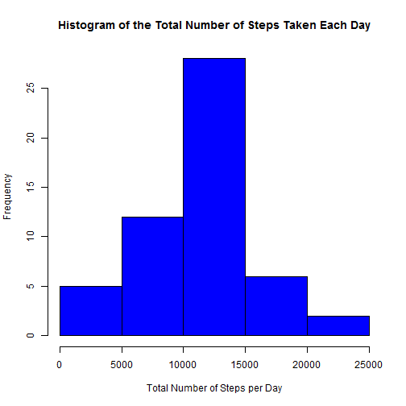
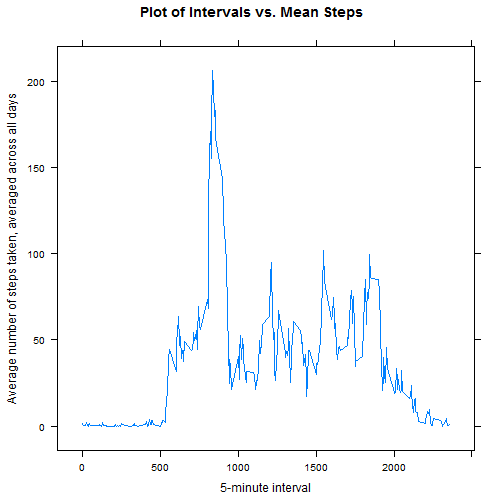
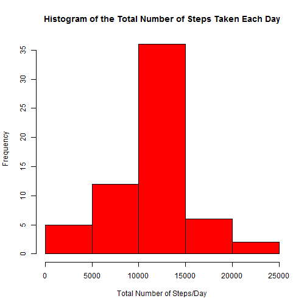
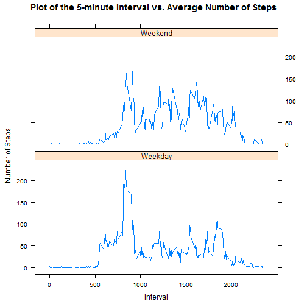

# Reproducible Research: Peer Assessment 1

## Introduction

This document is the Peer Assessment Project reoport prepared for Reproducible Research Coursera Course. A step-by-step list is provided below to answer the project questions.

## Loading and preprocessing the data

The required libraries for this analysis are first loaded:


```r
library(plyr)
library(lattice)
```


First Unzip the data in a sub-directory named 'activity' and read the data


```r
setwd("H:/RepData_PeerAssessment1")
activityData <- read.csv("./activity/activity.csv", header = TRUE, sep = ",")
```


### Check for the Attributes/properties of the data

```r
dim(activityData)  # Dimensions 
```

```
## [1] 17568     3
```

```r
names(activityData)  ## Variable Names 
```

```
## [1] "steps"    "date"     "interval"
```

```r
length(unique(activityData$date))  ## Number of days in the dataset
```

```
## [1] 61
```

```r
NoofObs <- table(activityData$date, useNA = "ifany")  ## Number of Observations for each day
sapply(activityData[1, ], class)  ## the class of each variable
```

```
##     steps      date  interval 
## "integer"  "factor" "integer"
```


### Process/transform the data into a format suitable for the analysis

This includes changing the class of the variable 'steps' and 'interval' to be Numeric and cleaning data by removing NAs.


```r
activityData$steps <- as.numeric(activityData$steps)
activityData$interval <- as.numeric(activityData$interval)
activityDataClean <- activityData[complete.cases(activityData), ]
```


## What is mean total number of steps taken per day?

### Prepare data to construct a histogram of the total number of steps taken each day

This step will be used to prepare data to construct a histogram of the total number of steps taken each day by calculating the total number of steps for each day


```r
DaySteps <- ddply(activityDataClean, c("date"), function(x) apply(x[1], 2, sum))
head(DaySteps)
```

```
##         date steps
## 1 2012-10-02   126
## 2 2012-10-03 11352
## 3 2012-10-04 12116
## 4 2012-10-05 13294
## 5 2012-10-06 15420
## 6 2012-10-07 11015
```


Then a histogram of the total number of steps taken each day is constructed


```r
hist(DaySteps$steps, xlab = "Total Number of Steps per Day", main = "Histogram of the Total Number of Steps Taken Each Day", 
    col = "blue")
```

 


In the following steps, the mean and median total number of steps taken per day are calculated:


```r
mean(DaySteps$steps, na.rm = TRUE)  # the mean of total steps per day
```

```
## [1] 10766
```

```r
median(DaySteps$steps, na.rm = TRUE)  # the median of total steps per day
```

```
## [1] 10765
```


## What is the average daily activity pattern?

### Calculate the mean of steps related to each interval:

```r
meanSteps <- ddply(activityDataClean, c("interval"), function(x) apply(x[1], 
    2, mean))
head(meanSteps)
```

```
##   interval   steps
## 1        0 1.71698
## 2        5 0.33962
## 3       10 0.13208
## 4       15 0.15094
## 5       20 0.07547
## 6       25 2.09434
```


### Make a time series plot (i.e. type = "l") of the 5-minute interval (x-axis)
### and the average number of steps taken, averaged across all days (y-axis)


```r

xyplot(meanSteps$steps ~ meanSteps$interval, type = "l", ylab = "Average number of steps taken, averaged across all days", 
    xlab = "5-minute interval", main = "Plot of Intervals vs. Mean Steps", lwd = 1.5)
```

 


In order to determine which 5-minute interval, on average across all the days in the dataset, contains the maximum number of steps, the following tasks were carried out:

#### First obtain the the maximum number of steps


```r
maxStep <- max(meanSteps$steps)
maxStep
```

```
## [1] 206.2
```

 
#### Then obtain the interval related to the maximum of mean step

```r
maxInt <- meanSteps[meanSteps$steps == max(meanSteps$steps), ]
maxInt
```

```
##     interval steps
## 104      835 206.2
```


or you can use the following and yield in thesame result: 

```r
maxInterval <- meanSteps[which.max(meanSteps$steps), 1]
maxInterval
```

```
## [1] 835
```


## Imputing missing values

In order to calculate and report the total number of missing values in the dataset (i.e. the total number of rows with NAs) the following steps were followed:

Check intervals with NA and number of rows with NA


```r
sum(is.na(activityData$interval))  # interval with NA 
```

```
## [1] 0
```

```r
sum(is.na(activityData$date))  # dates with NA
```

```
## [1] 0
```

```r
sum(is.na(activityData$steps))  # Total number of rows with NAs.
```

```
## [1] 2304
```


Then create a new dataset that is equal to the original dataset but with the missing data filled in. In this case, the missing values are filled by replacing the rows having NAs with the mean steps for each 5-min interval across all data.


```r
meanSteps <- ddply(activityDataClean, c("interval"), function(x) apply(x[1], 
    2, mean))
revisedData <- activityData
revisedData[1:288, 1] <- meanSteps$steps
revisedData[2017:2304, 1] <- meanSteps$steps
revisedData[8929:9216, 1] <- meanSteps$steps
revisedData[9793:10080, 1] <- meanSteps$steps
revisedData[11233:11520, 1] <- meanSteps$steps
revisedData[11521:11808, 1] <- meanSteps$steps
revisedData[12673:12960, 1] <- meanSteps$steps
revisedData[17281:17568, 1] <- meanSteps$steps
```

And check if NAs are removed:


```r
sum(is.na(revisedData))
```

```
## [1] 0
```


Then, calculate the sum of steps for each day:
       

```r
revisedmeanSteps <- ddply(revisedData, c("date"), function(x) apply(x[1], 2, 
    sum))
```


Then, make a histogram of the total number of steps taken each day and Calculate and report the mean and median total number of steps taken per day and compare these values from the estimates from the first part of the assignment.


```r
hist(revisedmeanSteps$steps, xlab = "Total Number of Steps/Day", main = "Histogram of the Total Number of Steps Taken Each Day", 
    col = "red")
```

 

```r
mean(revisedmeanSteps$steps)
```

```
## [1] 10766
```

```r
median(revisedmeanSteps$steps)
```

```
## [1] 10766
```


This histogram shows a slightly different results as compared to the previous one which was created before filling the NAs. This histogram shows higher frequency around mean steps. The mean stayed exactly the same as before and substituting missing data did not have a major effect on the estimated total daily number of steps.

The median, however, slightly increased when missing vluaes were substituted and the substitution did not have a noticable effect on the estimates of the total daily number of steps.
 

## Are there differences in activity patterns between weekdays and weekends?

This was accomplished by creating a new factor variable in the dataset with two levels - "weekday" and "weekend", indicating whether a given date is a weekday or weekend day and adding new column to the dataset 'revisedData' containing the week days'names.


```r

revisedData$WeekD <- weekdays(as.Date(revisedData$date))
revisedData$WeekD[revisedData$WeekD == "Friday"] <- "Weekday"
revisedData$WeekD[revisedData$WeekD == "Monday"] <- "Weekday"
revisedData$WeekD[revisedData$WeekD == "Thursday"] <- "Weekday"
revisedData$WeekD[revisedData$WeekD == "Tuesday"] <- "Weekday"
revisedData$WeekD[revisedData$WeekD == "Wednesday"] <- "Weekday"
revisedData$WeekD[revisedData$WeekD == "Saturday"] <- "Weekend"
revisedData$WeekD[revisedData$WeekD == "Sunday"] <- "Weekend"
table(revisedData$WeekD)
```

```
## 
## Weekday Weekend 
##   12960    4608
```


Then a panel plot containing a time series plot of the 5-min
interval and the average number of steps taken, averaged across all
weekday days or weekend days, was constructed.


```r
newMeanSteps <- ddply(revisedData, c("interval", "WeekD"), function(x) apply(x[1], 
    2, mean))

xyplot(newMeanSteps$steps ~ newMeanSteps$interval | newMeanSteps$WeekD, type = "l", 
    ylab = "Number of Steps", xlab = "Interval", main = "Plot of the 5-minute Interval vs. Average Number of Steps", 
    layout = c(1, 2))
```

 


